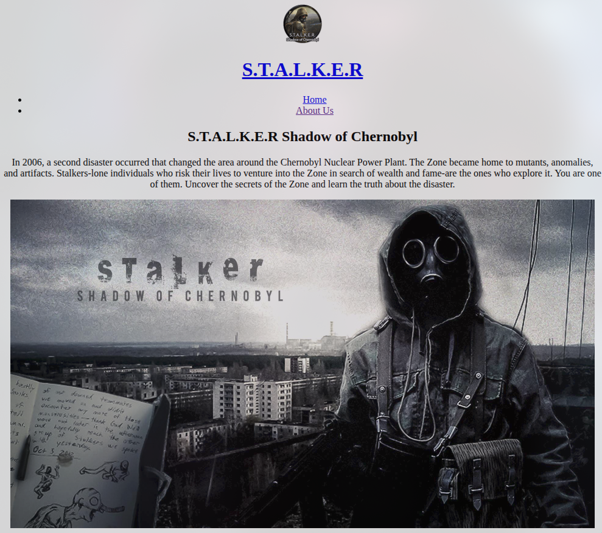

# ☢️ Landing Page - S.T.A.L.K.E.R: Shadow of Chernobyl

Учебный лендинг по игре S.T.A.L.K.E.R.: Shadow of Chernobyl. Проект сфокусирован на семантической HTML-разметке - CSS-стилизация ещё не написана.

---

## 🚀 Функционал

- Хедер с логотипом и навигацией
- Hero-секция с описанием игры, списком фич и тремя тематическими карточками
- Таблица оружия и снаряжения с группировкой по категориям
- Секция с трейлером игры (YouTube embed) и формой вступления в сообщество
- Галерея скриншотов из игры
- Футер с картой Чернобыля (Google Maps), соцсетями и копирайтом

---

## 🛠 Стек технологий

- HTML5
- Методология: BEM
- Font Awesome (CDN)
- Git & GitHub

---

## 📸 Скриншоты

>  

---

## 📂 Структура проекта

```
Landing-Page-Stalker/
├── icons/
│   ├── favicon/
│   └── logo.png
├── img/
│   ├── main-img.jpg
│   ├── image-1.jpg ... image-6.png
├── index.html
└── README.md
```

---

## ⚙️ Запуск проекта

```bash
git clone https://github.com/xamiuez/landing-stalker.git
cd landing-stalker
```

Открыть `index.html` в браузере

---

## 📌 Планы по улучшению

**Главное**

- Ознакомиться с макетом и написать CSS с нуля
- Убрать легаси-код: `align="center"`, `border="1"`, `bgcolor`, `style="border:0;"`

**BEM**

- `hero__features--title`, `hero__article--wrapper`, `header__logo--image` и подобные - `--` только для модификаторов, исправить на одиночный дефис
- `<h1>` внутри `<a>` → заменить на `<span>`

**HTML / семантика**

- Выровнять иерархию `<h2>` - используется и для секций, и для подзаголовков внутри `<article>`
- `<iframe>` карты `width="1440"` → `width="100%"`

**Адаптивность**

- Реализовать для трёх брейкпоинтов после написания стилей